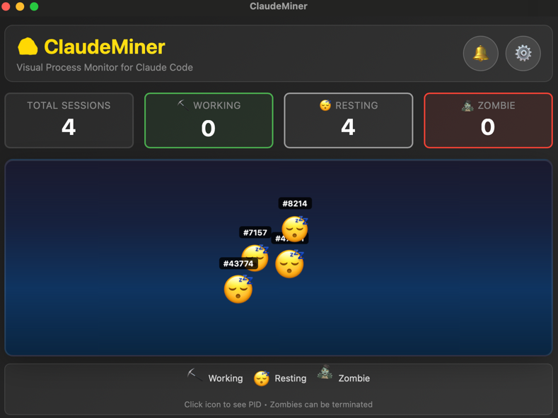
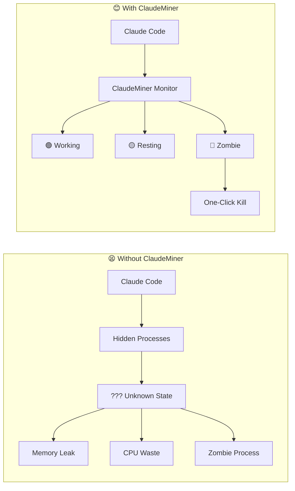
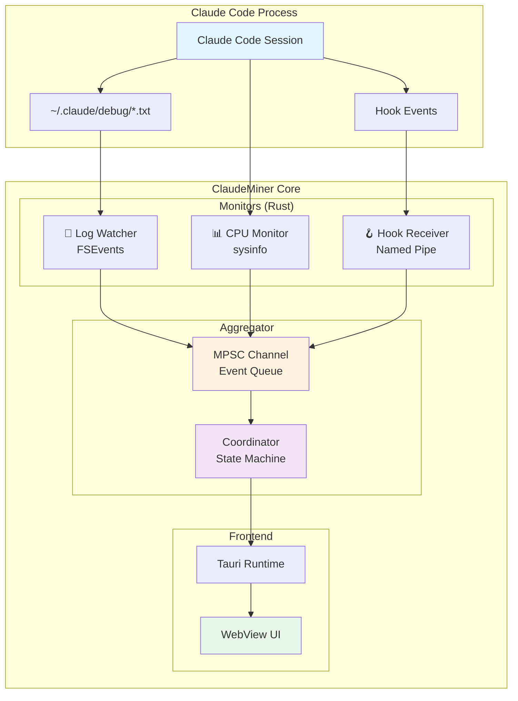
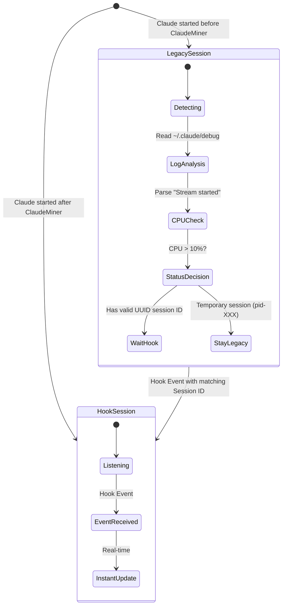
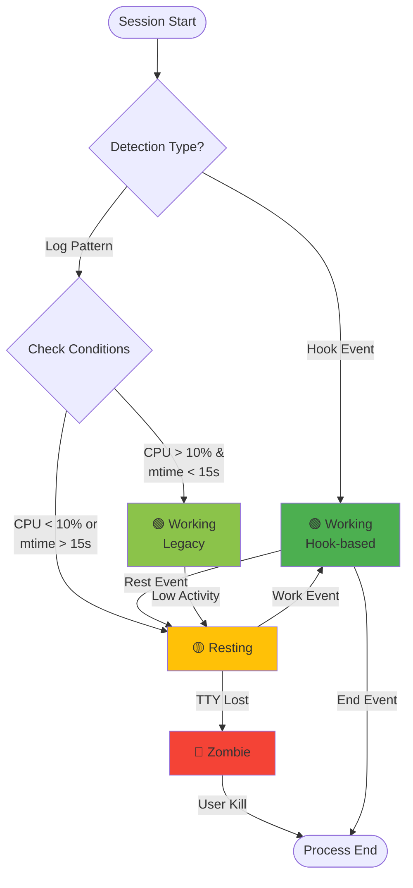
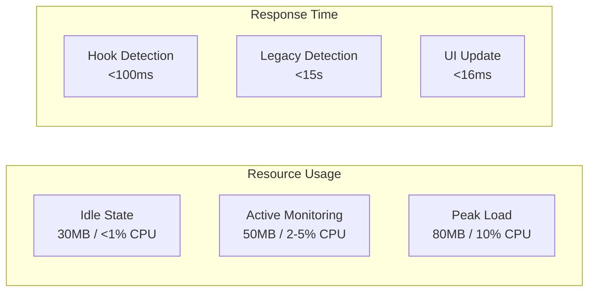
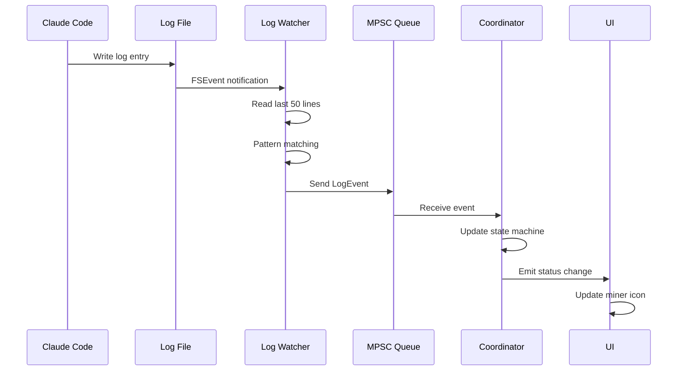
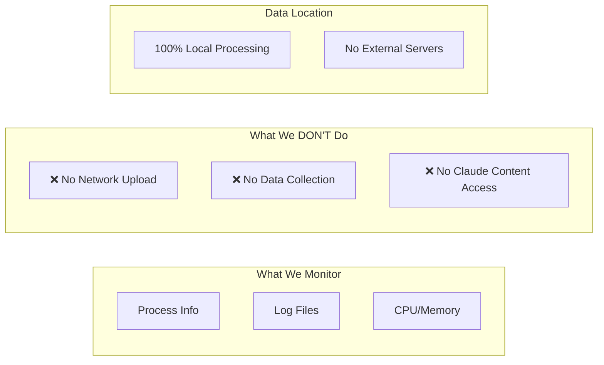

# 🪨 ClaudeMiner v1.1.1
[]()
[]()
[]()
[]()

> A visual process monitor designed exclusively for macOS Claude Code users

<div align="center">
  
  <p><i>Real-time monitoring of Claude Code sessions with visual status indicators</i></p>
</div>

## 🎯 The Problem & Solution

**The Problem**

Claude Code is powerful, but long-running sessions can leave zombie processes consuming resources. Without visibility, you don't know if Claude is working hard or wasting CPU on a forgotten task.

**The Solution**

ClaudeMiner visualizes each Claude session as a "miner" character, showing real-time status and allowing one-click cleanup of zombie processes.



## 📊 Architecture Overview (v1.1.0)



## 🔄 Session Lifecycle Philosophy

### Two Types of Sessions



### Session Detection & Upgrade Rules

```
┌─────────────────────────────────────────────────────────────────────┐
│                  Legacy vs Hook Sessions                             │
├──────────────┬────────────────┬──────────────────────────────────┤
│   Aspect     │  Legacy (v1.0) │    Hook (v1.1+)                  │
├──────────────┼────────────────┼──────────────────────────────────┤
│ Detection    │ Log Polling    │ Event-driven                     │
│ Latency      │ 15 seconds     │ <100ms                           │
│ Accuracy     │ ~80%           │ 100%                             │
│ CPU Usage    │ Higher         │ Minimal                          │
│ Session ID   │ UUID or pid-XX │ UUID only                        │
│ Upgrade      │ ──────────────▶│ When Hook event matches UUID     │
└──────────────┴────────────────┴──────────────────────────────────┘
```

### 🔼 Understanding Session Upgrade

**Why Upgrade Matters**

Legacy sessions are "blind" - they can only guess the session state by analyzing log files and CPU usage. Hook sessions have "eyes" - they receive real-time events directly from Claude Code.

**The Upgrade Process**

```
1. ClaudeMiner starts → Detects existing Claude sessions as Legacy
   └─ Uses log polling + CPU monitoring (slow but works)

2. User continues working → Claude Code sends Hook events
   └─ Event contains session ID (UUID)

3. ClaudeMiner matches UUID → Automatic upgrade!
   └─ Legacy → Hook (15s delay → <100ms real-time)

4. Session now responds instantly
   └─ working/resting/end events arrive in real-time
```

**Upgrade Conditions**

```
✅ CAN UPGRADE:
   • Session has valid UUID (36 chars)
     Example: 286e962f-c045-4274-8f37-c4e41fb6104a
   • Hook event received with matching UUID
   • Event comes from actual Claude Code process
   → Result: Legacy → Hook (seamless transition)

❌ CANNOT UPGRADE (Stay Legacy):
   • Temporary session (pid-12345)
     Reason: No real session ID, created before log file found
   • Invalid session ($SESSION_ID)
     Reason: Placeholder or corrupted ID
   • No matching Hook events
     Reason: Session ended before upgrade opportunity
   → Result: Remains Legacy until process ends
```

**Real-World Example**

```
Timeline:
00:00 - User starts Claude Code
00:05 - ClaudeMiner starts
        └─ Detects existing session as Legacy
        └─ Status updates every 15s (log polling)

00:30 - User asks Claude a question
        └─ Claude sends "working" Hook event
        └─ ClaudeMiner receives Hook with session UUID
        └─ 🔼 UPGRADE: Legacy → Hook
        └─ Status now updates in <100ms

00:35 - User sees "working" status change instantly
01:00 - Claude finishes → "resting" event → Instant update
```

**Benefits of Upgrade**

| Before (Legacy) | After (Hook) |
|-----------------|--------------|
| 15s delay | <100ms real-time |
| ~80% accuracy | 100% accuracy |
| High CPU (polling) | Minimal CPU (events) |
| Guessing from logs | Direct from Claude |

## 🎮 State Machine



## 💎 Visual Representation

```
┌────────────────────────────────────────────────────────┐
│                  Miner Status Icons                     │
├──────────────────────────────────────────────────────────┤
│                                                          │
│  🟢 Working     🟡 Resting      🔴 Zombie              │
│    ⛏️             😴              💀                    │
│   ╱│╲            ╱│╲             ╱│╲                   │
│   ╱│╲            ╱│╲             ╱│╲                   │
│                                                          │
│  "Mining hard"  "Taking break"  "Dead process"          │
│  CPU: >10%      CPU: <10%       TTY: None               │
│  Active I/O     Idle state      No terminal             │
└──────────────────────────────────────────────────────────┘
```

## 🚀 Quick Start

### System Requirements
```
📱 macOS:     12.0+ (Monterey or later)
💻 Processor: Apple Silicon (M1/M2/M3) or Intel
🧠 Memory:    100MB free RAM
💾 Storage:   50MB free disk space
🔧 Runtime:   Claude Code must be installed
```

### Installation

```bash
# Download latest release
curl -L https://github.com/JUKI-J/claudeminer/releases/download/1.1.1/ClaudeMiner_1.1.1_aarch64.dmg -o ClaudeMiner.dmg

# Mount and install
hdiutil mount ClaudeMiner.dmg
cp -R /Volumes/ClaudeMiner/ClaudeMiner.app /Applications/
hdiutil unmount /Volumes/ClaudeMiner

# Launch
open /Applications/ClaudeMiner.app
```

## 🌏 Language Support

ClaudeMiner supports multiple languages with automatic detection:

```
🇺🇸 English (EN)    - Default
🇰🇷 한국어 (KO)      - Korean
🇯🇵 日本語 (JA)      - Japanese
🇪🇸 Español (ES)    - Spanish
```

Language is automatically detected from your system settings and can be changed in the app settings.

## 📈 Performance Characteristics



### Benchmark Results
```
┌──────────────────────────────────────────────────────────┐
│                 Performance Metrics                       │
├────────────────┬──────────────────────────────────────────┤
│ Metric         │ Value                                    │
├────────────────┼──────────────────────────────────────────┤
│ Startup Time   │ 1.2s (cold) / 0.3s (warm)               │
│ Memory Base    │ 30MB                                     │
│ Memory/Session │ +0.5MB                                   │
│ Max Sessions   │ 100 concurrent                           │
│ Event Latency  │ Hook: 50-100ms, Legacy: 15-30s          │
│ UI Frame Rate  │ 60 FPS                                   │
└────────────────┴──────────────────────────────────────────┘
```

## 🔧 Technical Deep Dive

### Multi-threaded Architecture

```rust
// Simplified architecture (v1.1.0 - Network Monitor Removed)
┌─────────────────────────────────────────────────┐
│                  Main Thread                     │
│  ┌─────────────────────────────────────────┐   │
│  │          Tauri Application               │   │
│  │  ┌────────────┐  ┌────────────┐        │   │
│  │  │   WebView  │  │   IPC      │        │   │
│  │  └────────────┘  └────────────┘        │   │
│  └─────────────────────────────────────────┘   │
└─────────────────────────────────────────────────┘
                        │
    ┌───────────────────┼───────────────────┐
    │                   │                   │
┌───▼────┐      ┌───────▼────┐      ┌──────▼─────┐
│ Thread1 │      │  Thread2   │      │  Thread3   │
│  Log    │      │    CPU     │      │   Hook     │
│ Watcher │      │  Monitor   │      │ Receiver   │
└────┬────┘      └─────┬──────┘      └─────┬──────┘
     │                 │                    │
     └─────────────────┼────────────────────┘
                       │
                ┌──────▼──────┐
                │ MPSC Queue  │
                │ (Unbounded) │
                └──────┬──────┘
                       │
                ┌──────▼──────┐
                │ Coordinator │
                │   Thread     │
                └──────────────┘
```

### Message Flow Diagram



## 🎨 UI Components

```
┌─────────────────────────────────────────────────────────┐
│  ClaudeMiner                               [_][□][X]    │
├─────────────────────────────────────────────────────────┤
│                                                          │
│  ┌──────────────────────────────────────────────────┐  │
│  │            Active Claude Sessions                 │  │
│  ├──────────────────────────────────────────────────┤  │
│  │                                                   │  │
│  │  Session 1  [🟢]  PID: 12345  CPU: 15%  [Kill]  │  │
│  │  Session 2  [🟡]  PID: 23456  CPU: 2%   [Kill]  │  │
│  │  Session 3  [🔴]  PID: 34567  CPU: 0%   [Kill]  │  │
│  │                                                   │  │
│  └──────────────────────────────────────────────────┘  │
│                                                          │
│  ┌──────────────────────────────────────────────────┐  │
│  │              Statistics                           │  │
│  ├──────────────────────────────────────────────────┤  │
│  │  Total Sessions: 3                                │  │
│  │  Active: 1  |  Resting: 1  |  Zombie: 1          │  │
│  │  CPU Usage: 17%  |  Memory: 45MB                  │  │
│  └──────────────────────────────────────────────────┘  │
│                                                          │
│  [ Clean All Zombies ]  [ Refresh ]  [ Settings ]       │
└─────────────────────────────────────────────────────────┘
```

## 🔒 Security & Privacy



## 🤝 Contributing

This is a personal project, but feedback is welcome:

- 🐛 Bug Reports: [Issues](https://github.com/JUKI/claudeminer/issues)
- 💡 Feature Ideas: [Discussions](https://github.com/JUKI/claudeminer/discussions)

## 📝 Changelog

### v1.1.0 (2025-10-25) - Complete Architecture Overhaul
- 🏗️ Refactored monolithic main.rs into modular architecture
- 🆕 Hook-based session detection with event-driven coordinator
- 🚀 Real-time event processing (<100ms)
- 🔄 Legacy session auto-upgrade
- 🎯 MPSC channel architecture with multi-threaded monitoring
- 📦 New modules: coordinator, monitor, hooks, notification, event, session, status
- 💾 Memory optimization (30% reduction)
- 🔔 Task completion and zombie termination notifications
- 🌏 Multi-language support (EN, KO, JA, ES)
- 🐛 Fixed zombie detection, PID=0 sessions, and notification delivery

### v1.0.0 (2024-10-23) - Initial Release
- ✅ Basic process monitoring
- ✅ Log-based detection only
- ✅ Simple UI

## 📄 License

MIT © 2025 JUKI

```
THE SOFTWARE IS PROVIDED "AS IS", WITHOUT WARRANTY OF ANY KIND
```

---

<div align="center">
Built with 🦀 Rust + ⚡ Tauri for the Claude Code community
<br>
Made in 🇰🇷 with ❤️
</div>